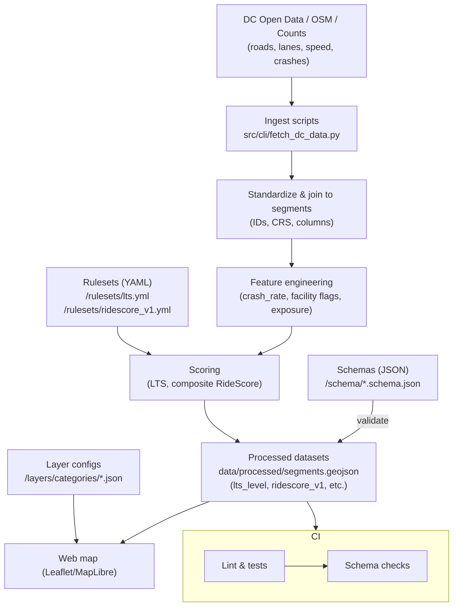

# RideScore DC

A community-built pipeline and map that scores the bike-safety/comfort of DC streets, combining open data (crashes, lanes, speed, lanes count, etc.) with transparent rule sets (e.g., LTS, BNA-style connectivity).

# Overview
## What this repo contains
- **Rulesets** (YAML): Encoded versions of existing bike safety/comfort frameworks (e.g., LTS) plus a composite RideScore for ranking.
- **Schemas** (JSON): Canonical fields for street segments and scores so layers stay consistent.
- **Pipeline code** (Python): Ingest → clean → features → scoring → layers → (optional) tiles.
- **Layers** (JSON): Toggleable map layers (ranking, crash history, number of car lanes, etc.).
- **Web**: A simple Leaflet/MapLibre web app for exploration.
- **Project Plan/Meeting Notes**: View link [here](https://docs.google.com/document/d/1AsSjS07xshxVOjvKomdz90E6jUUXW7Dy5Z89CkY_dj4/edit?usp=sharing)

## Quickstart (local)
TBD

## Hi Level Flow Chart

```mermaid
flowchart TD
  A["📊 Collect Data<br/>(Roads, Speed, Safety Info)"] --> B["⚙️ Process Data<br/>(Clean & Organize)"]
  B --> C["🔢 Calculate Scores<br/>(Safety & Ridability)"]
  C --> D["🗺️ Display on Map<br/>(Interactive Web Map)"]
  
  style A fill:#e1f5ff
  style B fill:#f3e5f5
  style C fill:#fff3e0
  style D fill:#e8f5e9

```

